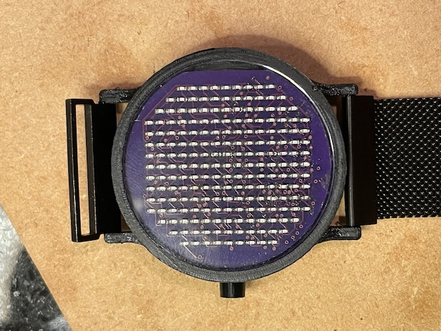
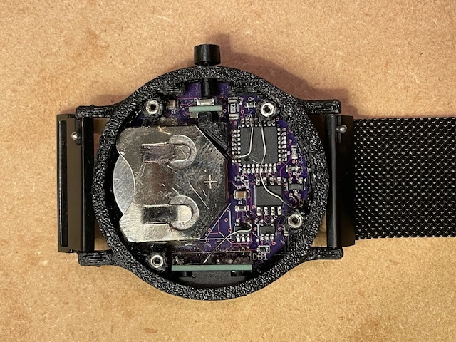
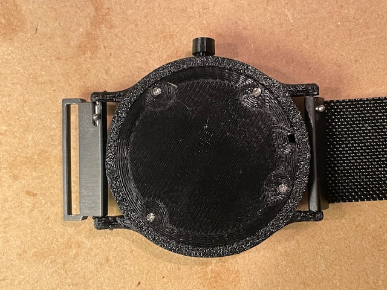

# Sonar Watch

### Hello all! 

### This project is inspired by something that I wanted to buy, but could not find online - so I decided to make it.

  

### When the button is pressed, the watch sends out a "ping" to find the location of the hour (inner radial dot) and minute (outer radial dot), thus telling the time.

  
   
  
   
  
   
  

